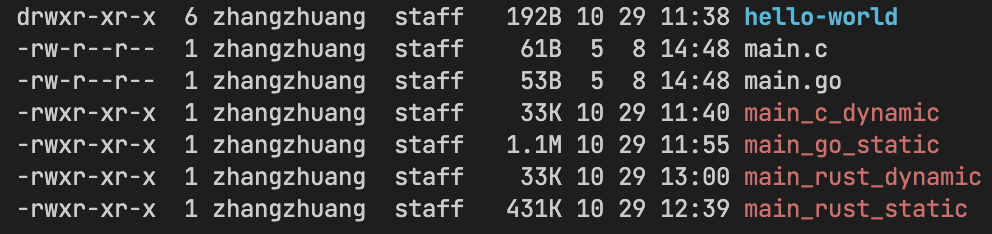

编译一段最简单的示例代码hello world，C语言编译出来的二进制文件要远小于go语言编译的结果。  

为什么会这样呢？  


* c语言在编译的时候，**默认采用动态链接的编译方式**，因此会比较小，特别是常用的头文件，它的实现位于libc的动态库中，不会被拷贝到编译出来的二进制文件当中，使得二进制文件体积更小，一般是48KB(macOS上)/16KB(Linux上）。
    > 使用静态链接的编译方式，得到的二进制文件体积为889KB左右；  
    > 再用 strip 处理后体积来到 691KB 左右； 
    > 注意这里并没有开启 gcc 的 `-O`参数；


* go语言在编译的时候，**默认采用静态链接的编译方式**，虽然体积很大，但是并不会依赖具体的动态库，可移植性非常好，同时它自身的package之间存在嵌套引入，即便你引入了一个package，可实际上这个package实现的时候需要引入其他的package，造成编译出来的二进制文件体积很大。当go采用内置的`println`函数，并且使用`go build -ldflags="-w -s" -o main main.go`，得到的二进制文件会加以缩小，达到大约780KB左右。
    > 和静态链接编译下的C相比，go还是非常紧凑的。


* 如果使用Rust编译的话，二进制文件体积会更加乐观
    * `cargo build` 得到 447KB;
    * `cargo build --release` 得到 244KB;
    > Rust和Go一样，**默认采用静态链接的编译方式**，将自身的一些标准库编译进去。但是从结果来看，Rust比Go好，说明Rust对C的封装抽象更少，而且没有垃圾回收运行时，也省去了一部分代码。

    看看rust如何动态编译吧：
    ```shell
    # macOS 13.0
    # arm64
    # M1 Pro chip
    # clang 14.0.0
    # rustc 1.64.0 (a55dd71d5 2022-09-19)

    # rust 采用动态链接编译代码
    cargo rustc --release -C prefer-dynamic

    # 生成二进制代码，假设叫做main

    # 把 main 移动到你当前的目录中执行，移动步骤省略
    ./main 

    # 执行报错！

    # 因为你在编译代码的时候，采用了动态编译，在执行时，链接器
    # 程序加载外部库时，会在环境变量 DYLD_LIBRARY_PATH 中寻找，
    # 但是没有找到，就报错了
    # reference: https://ww2.mathworks.cn/help/matlab/matlab_external/set-run-time-library-path-on-mac-systems.html 
    # Thanks to the Author(#^.^#)

    # 重定向动态链接库搜索路径
    DYLD_LIBRARY_PATH="<YOUR_HOME_PATH>/.rustup/toolchains/stable-aarch64-apple-darwin/lib" ./main 

    # Thanks God! It works!
    ```
    > 动态编译下，rust依旧会把 rust runtime编译进去；


**对比图**


> `_static`表示采用静态链接编译；
> `_dynamic`表示采用动态链接编译；

**总结**  
站在一个偏OS的应用层语言，Go已经非常出众了；   
站在一个偏OS的系统层语言，Rust和C更出众，足够小，没有垃圾回收；
站在Rust和C的比较层面上，Rust非常优秀，近乎C；

---

<br>

## 尝试
安装好 go,gcc,rust后，可以尝试：

静态链接方式，编译GO：
`go build -o main_go_static main.go`  

动态链接方式，编译GO：
`go build -linkshared -o main_go_dynamic main.go`
> 很难过的是，macOS不支持`-linkshared`
   
动态链接方式，编译C：
`gcc -o main_c_dynamic main.c`  

静态链接方式，编译C：
`gcc -static -o main_c_static main.c`   
> 很难过的是，macOS不支持 `-static`

静态链接方式，编译Rust：
`cd hello-world && cargo build --release`

动态链接方式，编译Rust：
`cd hello-world && cargo rustc -C prefer-dynamic --release`


比对一下 二进制文件的大小吧